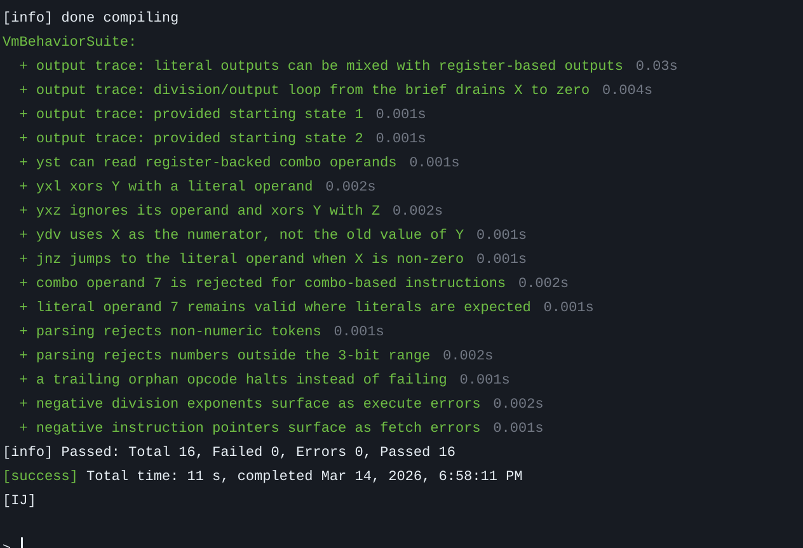

### Example inputs
Results of launching on provided examples using `sbt run` and `ThreeBitDemo.scala`: 

```text
╭─────────────────────────────────────╮
│ Provided starting state 1           │
├─────────────────────────────────────┤
│ initial: X=3729 Y=0 Z=0             │
│ tape   : |0||1||5||4||3||0|         │
│ trace  : Xdv(1) -> Out(X) -> Jnz(0) │
│ output : 0,4,2,1,4,2,5,6,7,3,1,0    │
│ expect : 0,4,2,1,4,2,5,6,7,3,1,0    │
│ status : OK                         │
╰─────────────────────────────────────╯

╭─────────────────────────────────────╮
│ Provided starting state 2           │
├─────────────────────────────────────┤
│ initial: X=8642024 Y=0 Z=0          │
│ tape   : |0||3||5||4||3||0|         │
│ trace  : Xdv(3) -> Out(X) -> Jnz(0) │
│ output : 5,7,6,5,7,0,4,0            │
│ expect : 5,7,6,5,7,0,4,0            │
│ status : OK                         │
╰─────────────────────────────────────╯

```
### Unit tests
Unit tests for corner cases using `sbt test`  and `VMBehaviorSuite.scala` (text is copyable if `.svg` opened directly):


### Optional failure diagnostics

The test suite supports an optional boxed diagnostic format on assertion failure when ran with `sbt test -Dvm.pretty=true`.

Example diagnostic card:

```text
╭──────────────────────────────────────────────────────────────╮
│ Failure: yxl xors Y with a literal operand                   │
├──────────────────────────────────────────────────────────────┤
│ initial: X=0 Y=29 Z=0                                        │
│ tape   : |1||7|                                              │
│ decode : Yxl(7)                                              │
│ expect : Right(26)                                           │
│ got    : Right(25)                                           │
│ note   : Example diagnostic card shown in the README.        │
╰──────────────────────────────────────────────────────────────╯
```

